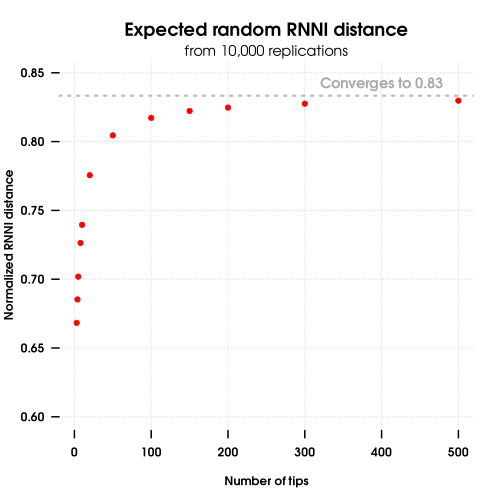

# rrnni
## Manipulate with RNNI tree space

The **rrnni** package contains a collection of functions to create, convert and
manipulate ranked trees. The `rrnni::rnni` function then calculates
RNNI distance between two trees in the RNNI space.

## Install

To get **rrnni** from CRAN, type:

```{r}
install.packages("rrnni")
```

or can install the latest version of **rrnni** from github:

```{r}
devtools::install_github("biods/rrnni")
```

## Usage

Create a new random ranked tree with 5 tips:

```{r}
library("rrnni")
tree = rankedPhylo(5)
```

Convert an ultrametric tree, such as from `ape::rcoal`, to ranked tree:

```{r}
tree = ape::rcoal(5)
tree = rankedPhylo(tree)
```

Calculate RNNI distance between two ranked trees:

```{r}
x = rankedPhylo(5)
y = rankedPhylo(5)
rnni(x, y)
```

## What is RNNI?

RNNI stands for Ranked Nearest Neighbour Interchange and is an extension of the classical NNI space (space of trees created by the NNI moves) to ranked trees, where internal nodes are ordered according to their heights (usually assumed to be times).
Since ranked trees are variants of time trees, they keep the biologically relevant information about the timing of events, such as splits.
Note that we assume ultrametric trees, i.e. all leaves have the same time, and unique order of internal nodes, which means that two non-leaf nodes cannot have the same time.

The RNNI distance takes the tree topology into account, as standard NNI does, but also penalizes changes in the order of internal nodes, i.e. changes in the order of times of evolutionary events.

### Useful properties of the RNNI space

The RNNI space has many useful and biologically relevant properties. Of immediate interest is the maximum and random distances.

The maximum distance, or radius, of two trees is `(n-1)*(n-2)/2`. For example, for a tree with 5 tips, the maximum distance is 6. This maximum distance is used to obtain the normalized RNNI distance between trees `x` and `y`: `rnni(x,y, normalize=TRUE)`.

The expected random distance between two trees converges to `5/6` of the diameter, i.e., for large enough trees, the expected random normalized distance is `5/6` or `0.8333`. For smaller trees (n<50), you can simulate the expected random normalized RNNI distance with:

```
library("rrnni")
# define random normalized RNNI distance
rnRNNI = function(n){rnni(rankedPhylo(n), rankedPhylo(n), normalize=TRUE)}

# calculate the expected rnRNNI
replicate(1000, rnRNNI) |> mean()
```




RNNI space has multiple advantages over the NNI space. One advantage is that the ranked moves make the space more "reticulated" or inter-connected. This changes the geometric properties of the space and makes it possible to calculate the shortest path (i.e., distance) between two trees in polynomial time, while calculating distance in NNI space is known to be difficult (non-polynomial, the dreadful "NP-hard") [Gavryushkin et al. (2018)][Gavryushkin2018].

A more theoretical, yet still biologically relevant, property of the RNNI space is that it has the so-called _cluster_ property, cluster being a group of related taxa. In RNNI space, the shortest path between two trees preserves clusters. This means that in RNNI space, small local changes in tree topology do not have a big impact on the distance. [Colliene et al. (2021)][Colliene2021]


### More details on the RNNI space

In the RNNI space, we allow two tree rearrangement moves (RNNI moves):
An NNI move can be performed on any edge connecting nodes of consecutive rank and swaps to neighbouring subtrees (just like standard NNI);
A rank move swaps the order of two internal nodes of consecutive ranks.
The distance between two ranked trees in RNNI is then defined as the minimum number of RNNI moves needed to convert one tree into the other.
This distance can be computed in polynomial time, using the FindPath algorithm described by [Collienne and Gavryushkin (2021)][CollieneGavryushkin2021].
Some further properties of the RNNI space can be found in [Colliene et al. (2021)][Colliene2021].

[Gavryushkin2018]: https://doi.org/10.1007/s00285-017-1167-9
[Colliene2021]: https://doi.org/10.1007/s00285-021-01685-0
[CollieneGavryushkin2021]: https://doi.org/10.1007/s00285-021-01567-5
